# BudgetTracker Android App


---


## Overview

**BudgetTracker** is a modern, cloud-powered Android app that helps users take control of their finances. With a beautiful, animated UI and seamless Firebase integration, it makes tracking expenses, setting goals, and celebrating achievements easy and fun.

> **Note:** This app is designed for light mode only and is not optimized for dark mode.

---

## ✨ Key Features

- **Firebase Cloud Storage**: All data (transactions, budgets, achievements, profiles) is securely stored and synced in real-time using Firebase Firestore and Storage.
- **User Authentication**: Secure registration and login with Firebase Auth.
- **Animated, Modern UI**: Material transitions, animated charts, and interactive feedback throughout the app.
- **Transaction Management**: Add, view, and filter expenses/income with receipt image support.
- **Budget Goals**: Set monthly min/max budgets and track progress visually.
- **Spending Analytics**: Animated pie and bar charts show category breakdowns and trends.
- **Achievements & Awards**: Earn badges for milestones, with a colorful, gamified achievements page.
- **Profile Management**: Update username, password, and profile image (with cloud upload).
- **Activity Summary**: See your financial stats and streaks in a beautiful summary.
- **Responsive Design**: Works great on phones and tablets.
- **CI/CD with GitHub Actions**: Automated builds, tests, and artifact generation for every commit.

## 🚀 Innovative Features

- **Easy-to-Read Financial Charts**  
  Show spending and savings using colourful charts, progress bars, or a feature that highlights leftover money.  
  _Helps users quickly see where their money is going and track their savings progress._

- **Goal Setting & Automated Savings**  
  Let users create savings goals (like for vacations or emergencies) and track their progress with visual indicators.  
  _Encourages regular saving by rounding up purchases or setting aside small amounts automatically._

- **Sync Across All Devices**  
  Allow users to access their financial data from their phone, tablet, or computer.  
  _Makes it easy to check budgets and savings anytime, anywhere._

- **Fun & Rewarding Budgeting**  
  Add a points or rewards system for staying on budget and saving money.  
  _Makes budgeting more exciting and motivates users to reach their financial goals (The PocketGuard, 2024)._

---

##  App Screenshots

### Welcome Screens
|             Splash Screen              |              Login Page              |               Register Page                |
|:--------------------------------------:|:------------------------------------:|:------------------------------------------:|
| 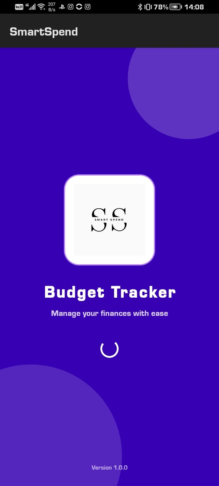 | 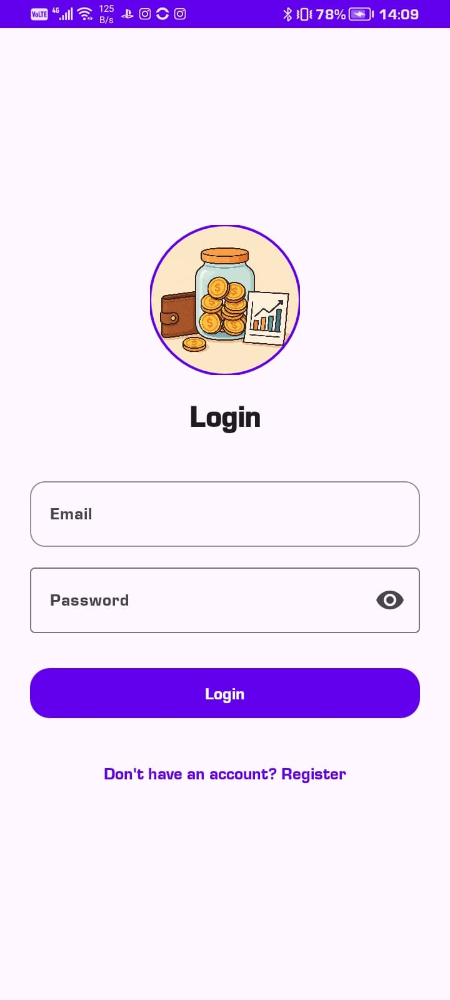 | 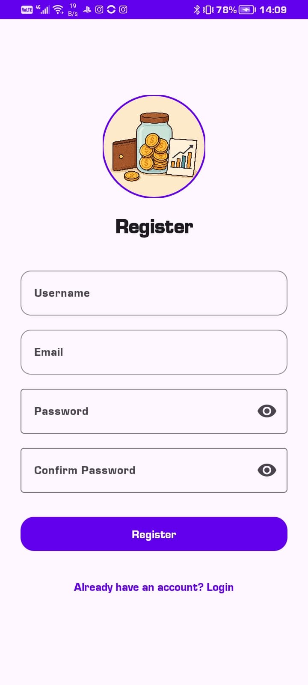 |

### Main Features
| Home Dashboard | Budget Management | Category Analysis | Transaction History |
|:-------------:|:----------------:|:-----------------:|:------------------:|
| 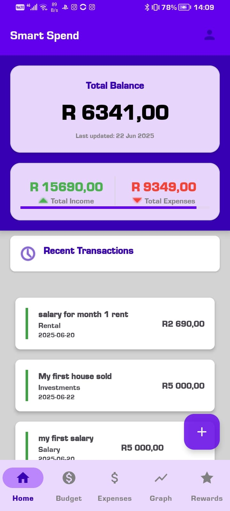 | 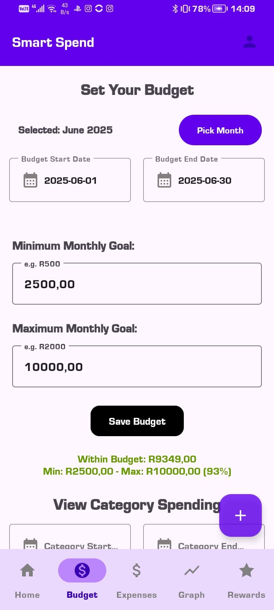 | 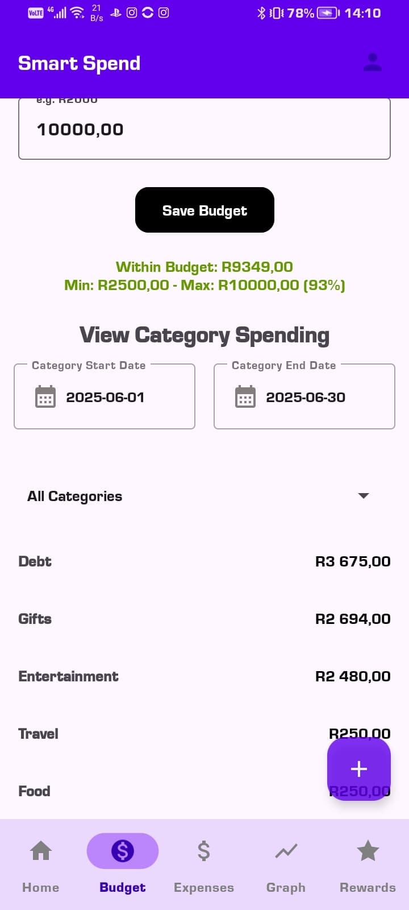 | 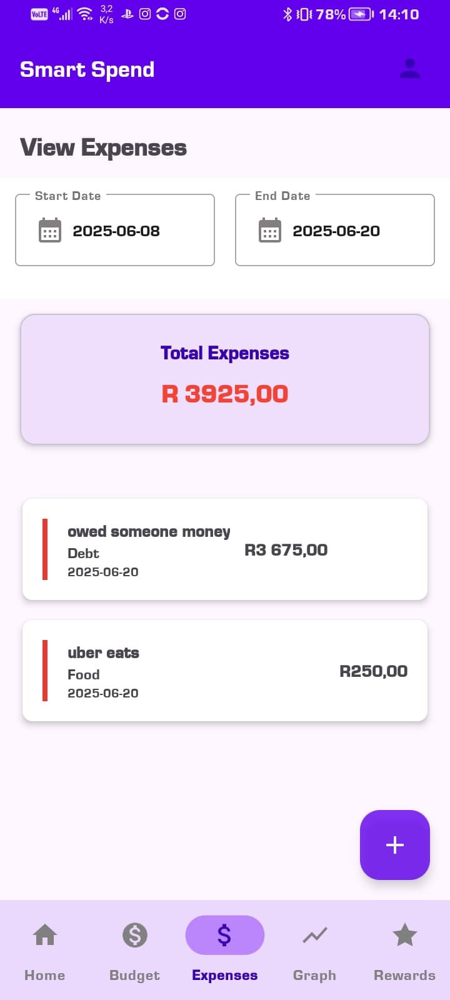 |

### Analytics & Achievements
| Spending Analytics | Detailed Analytics | Achievement Tracking |
|:-----------------:|:-----------------:|:------------------:|
| 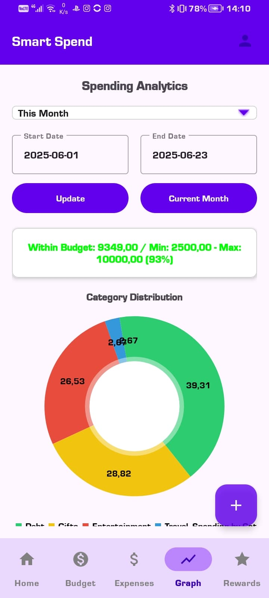 | 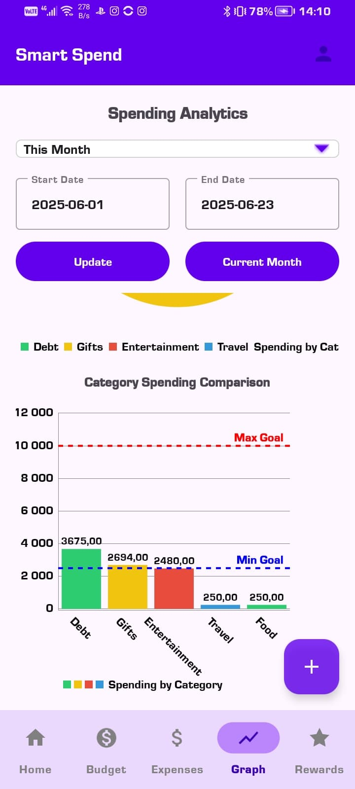 | 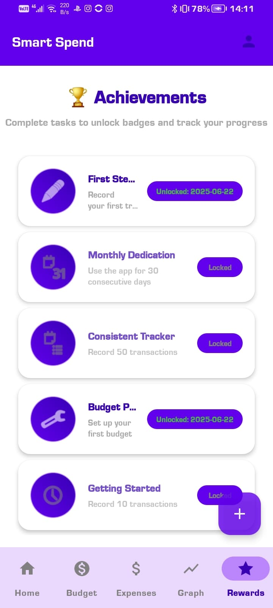 |

### Transaction Management
| Add Transaction - Step 1 | Add Transaction - Step 2 |
|:----------------------:|:----------------------:|
| 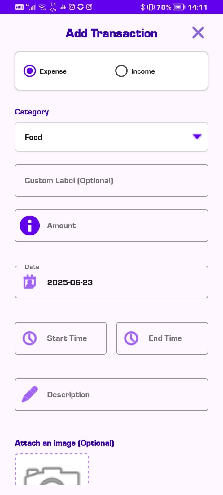 | 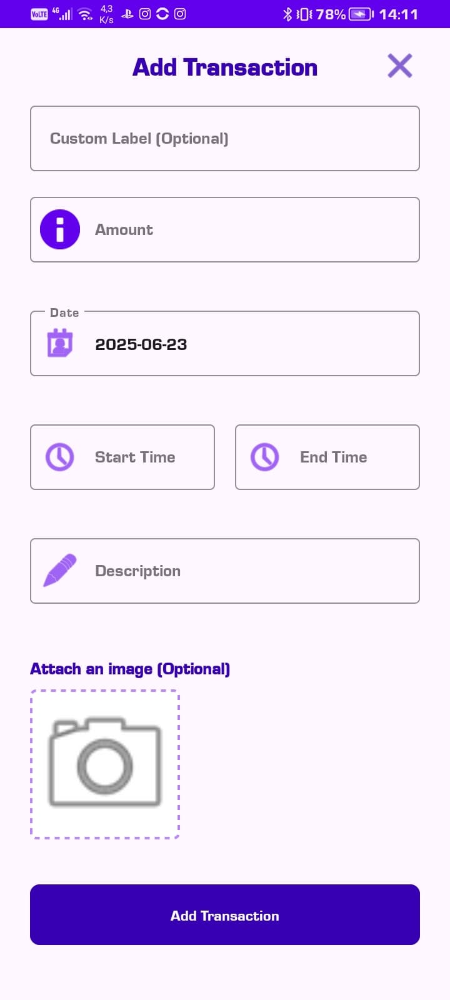 |

### User Profile
| Profile Overview | Profile Details |
|:---------------:|:--------------:|
| 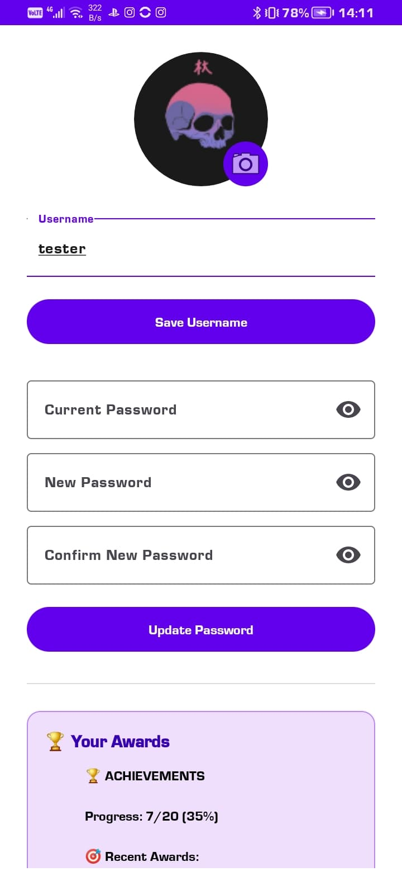 | 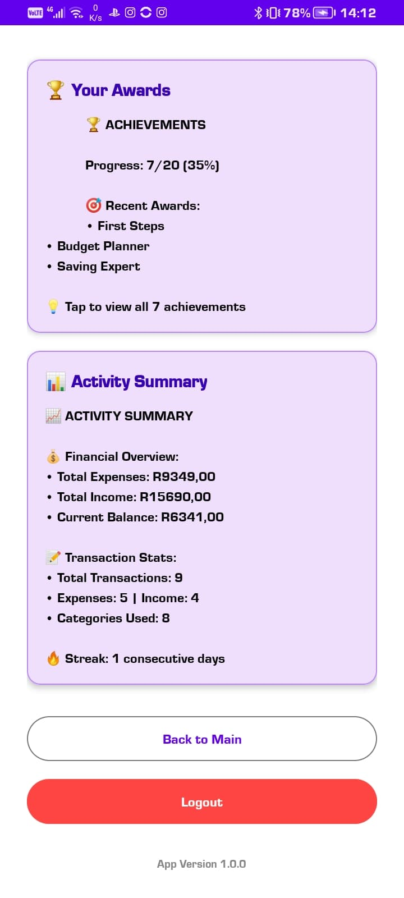 |

---

## 🚀 Design Considerations

- **Firebase-First**: All local storage (RoomDB) was removed for simplicity and real-time sync.
- **Material You**: Uses Material Components, animated transitions, and ripple effects for a delightful user experience.
- **Accessibility**: Large touch targets, clear color contrast, and readable fonts.
- **Performance**: Efficient data loading, smooth RecyclerView animations, and chart transitions.
- **Security**: Firestore and Storage rules ensure users can only access their own data.

---

## 🛠️ How to Build & Run

1. **Clone the Repository**
   ```bash
   git clone https://github.com/Sufyaan-Cassim/Budget-Tracker-App-P2.git
   ```
2. **Firebase Setup**
   - Create a Firebase project at [Firebase Console](https://console.firebase.google.com/)
   - Download `google-services.json` and place it in the `app/` directory
   - Enable Firebase Authentication, Firestore Database, and Storage
   - Configure Firestore and Storage security rules (see below)
3. **Open in Android Studio**
   - Open Android Studio and select the project folder.
4. **Build & Run**
   - Rebuild the project and run on an emulator or device.

---

## 🔒 Firebase Security Rules

### Firestore
```javascript
rules_version = '2';
service cloud.firestore {
  match /databases/{database}/documents {
    match /users/{userId} {
      allow read, write: if request.auth != null && request.auth.uid == userId;
      match /transactions/{transactionId} {
        allow read, write: if request.auth != null && request.auth.uid == userId;
      }
      match /budgets/{budgetId} {
        allow read, write: if request.auth != null && request.auth.uid == userId;
      }
      match /achievements/{achievementId} {
        allow read, write: if request.auth != null && request.auth.uid == userId;
      }
    }
    match /{document=**} {
      allow read, write: if false;
    }
  }
}
```

### Storage
```javascript
rules_version = '2';
service firebase.storage {
  match /b/{bucket}/o {
    match /profile_images/{userId} {
      allow read, write: if request.auth != null && request.auth.uid == userId;
    }
    match /{allPaths=**} {
      allow read, write: if false;
    }
  }
}
```

---

## 🧪 Testing

- **Unit Tests**: Run with `./gradlew testDebugUnitTest`
- **UI Tests**: Run from Android Studio (`src/androidTest`)
- **CI/CD**: Every push triggers GitHub Actions to build, test, and upload APK/AAB artifacts.

---

## 🤖 GitHub & GitHub Actions

- **Source Control**: All code and documentation are managed on GitHub.
- **CI/CD**: Automated workflows build, test, and generate artifacts for every commit.
- **Badges**: 
- **Artifacts**: Download APK/AAB from GitHub Actions build artifacts.

---

## 📄 Documentation & Report

This app was designed and built as a comprehensive, cloud-native budget tracker. All features are powered by Firebase for real-time sync and security. The UI/UX was modernized with:
- Animated transitions and chart updates
- Material You design
- Gamified achievements
- Profile and activity summary
- Responsive layouts and accessibility

**GitHub** was used for all source control, collaboration, and CI/CD. **GitHub Actions** automates builds, tests, and artifact delivery for every commit.

---

> _"BudgetTracker: Take control of your finances, one achievement at a time!"_